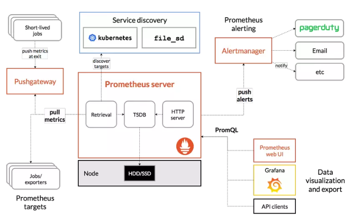

# 1. Giới thiệu  

- Prometheus là một dịch vụ theo dõi và cảnh báo về hệ thống. Đây là một dịch vụ mã nguồn mở (Open source) hoàn toàn miễn phí. .
- SoundCloud đã khởi đầu xây dựng Prometheus từ năm 2012. Giờ đây Prometheus đã được tách khỏi SoundCloud và là một dự án mã nguồn mở độc lập.
- Tính năng quan trọng nhất của Prometheus là thu thập thông số, dữ liệu từ các mục tiêu (dịch vụ) được nhắm đến theo khoảng thời gian nhất định đã được cài đặt trước. Ngoài ra còn các API khác thể hiện được kết quả, đánh giá bằng biểu thức quy tắc và đưa ra cảnh báo. Prometheus còn cung cấp một ngôn ngữ truy vấn rất mạnh PromQL, cực kì hữu ích khi giao tiếp với các dịch vụ monitor khác.
# 2. Tính năng 
  - Mô hình dữ liệu Time series đặc biệt phù hợp để theo dõi số liệu theo thời gian.
  - Có ngôn ngữ truy vấn riêng PromQL rất mạnh mẽ.
  - Tích hợp tốt với rất nhiềunền tảng ứng dụng.
  - Yêu cầu hạ tầng để triển khai đơn giản.
  - Hỗ trợ Push Gateway (khi làm việc với các dịch vụ tồn tại trong thời gian ngắn và hủy sau khi hoàn thành).
  - Có hỗ trợ Service discovery hoặc cấu hình tĩnh để tìm, nhắm mục tiêu cần theo dõi.
# 3. Đặc điểm
  - Prometheus là 100% mã nguồn mở. Bạn có thể coi mã nguồn tại Git : https://github.com/prometheus/prometheus/
  - Phần lớn các core tính năng của Prometheus được viết bằng ngôn ngữ Go. Một số còn lại thì được viết bằng Java, Python hoặc Ruby.
  - Prometheus không dùng để lấy dữ liệu log, thay vì vậy thì Prometheus là dịch vụ giám sát, thu thập và xử lý dữ liệu dạng metric (thông số).
  - Prometheus sử dụng cơ chế đi lấy (pull) dữ liệu từ máy chủ remote là chính, chứ không sử dụng cơ chế đợi remote đẩy (push) dữ liệu lên ngoại trừ trường hợp sử dụng PushGateway.
  - Prometheus sử dụng chương trình cảnh báo Alertmanager để xử lý và gửi cảnh báo đi.
  - Về phần giao diện biểu đồ (đồ thị) thì Prometheus sử dụng mã nguồn Grafana để tích hợp hiển thị.
  - Metric của Prometheus sử dụng chuẩn OpenMetrics.
  - Prometheus hỗ trợ 3 hình thức cài đặt các thành phần hệ thống gồm : Docker Image, cài đặt từ source với Go và file chương trình chạy sẵn đã được biên dịch sẵn.

# 4. Kiến trúc Prometheus
- Dưới đây là kiến trúc thường thấy của Prometheus

 
  -  Prometheus chủ động đi lấy dữ liệu theo dõi chứ không đợi các dịch vụ trả về. Vì vậy luôn đảm bảo phát hiện sớm những vấn đề có thể gây lỗi nghiêm trọng trong hệ thống. 
  - Theo lịch trình đã cài đặt Prometheus sẽ tự động thực hiện quá trình lấy các thông số/số liệu (metric) từ các dịch vụ, mục tiêu được chỉ định qua kết nối trực tiếp hoặc thông qua dịch vụ Pushgateway trung gian. Sau đó Prometheus sẽ lưu trữ các dữ liệu thu thập được ở máy chủ đang chạy. Tiếp đến là kiểm tra các rule đã được cài đặt để xử lý các dữ liệu theo nhu cầu cũng như kiểm tra và thực hiện các cảnh báo.

# 5. Thành phần chính trong Prometheus
- Máy chủ Ổmetheus
- Thư viên kết nối máy chủ Promtheus cho các ứng dụng. (Có thể sử dụng dạng JSON nếu không có thư viện hỗ trợ)
- Push Gateway Prometheus: sử dụng để hỗ trợ các job có thời gian thực hiện ngắn (tạm thời). Đơn giản là các tác vụ công việc này không tồn tại lâu đủ để Prometheus chủ động lấy dữ liệu. Vì vậy là mà các dữ liệu chỉ số (metric) sẽ được đẩy về Push Gateway rồi đẩy về Prometheus Server.
- Exporter hỗ trợ giám sát các dịch vụ hệ thống và gửi về Prometheus theo chuẩn Prometheus mong muốn.
- AlertManager: dịch vụ quản lý, xử lý các cảnh báo (alert).

# 6. Một số thuật ngữ
- **Time-series Data**: là một chuỗi các điểm dữ liệu, thường bao gồm các phép đo liên tiếp được thực hiện từ cùng một nguồn trong một khoảng thời gian.
- **Alert** : một cảnh báo (alert) là kết quả của việc đạt điều kiện thoả mãn một rule cảnh báo được cấu hình trong Prometheus. Các cảnh báo sẽ được gửi đến dịch vụ Alertmanager.
- **Alertmanager**: chương trình đảm nhận nhiệm vụ tiếp nhận, xử lý các hoạt động cảnh báo.
- **Client Library**: một số thư viện hỗ trợ người dùng có thể tự tuỳ chỉnh lập trình phương thức riêng để lấy dữ liệu từ hệ thống và đẩy dữ liệu metric về Prometheus.
- **Endpoint**: nguồn dữ liệu của các chỉ số (metric) mà Prometheus sẽ đi lấy thông tin.
- **Exporter**: là một chương trình được sử dụng với mục đích thu thập, chuyển đổi các metric không ở dạng kiểu dữ liệu chuẩn Prometheus sang chuẩn dữ liệu Prometheus. Sau đấy exporter sẽ expose web service api chứa thông tin các metrics hoặc đẩy về Prometheus.
- **Instance**: một instance là một nhãn (label) dùng để định danh duy nhất cho một target trong một job .
- **Job**: là một tập hợp các target chung một nhóm mục đích. Ví dụ: giám sát một nhóm các dịch vụ database,… thì ta gọi đó là một job .
- **PromQL**: là viết tắt của Prometheus Query Language, ngôn ngữ này cho phép bạn thực hiện các hoạt động liên quan đến dữ liệu metric.
- **Sample**: là một giá trị đơn lẻ tại một thời điểm thời gian trong khoảng thời gian time series.
- **Target**: một target là định nghĩa một đối tượng sẽ được Prometheus đi lấy dữ liệu (scrape). Ví dụ như: nhãn nào sẽ được sử dụng cho đối tượng, hình thức chứng thực nào sử dụng hoặc các thông tin cần thiết để quá trình đi lấy dữ liệu ở đối tượng được diễn ra.

# Tham khảo

- https://viblo.asia/p/prometheus-la-gi-924lJ3805PM

